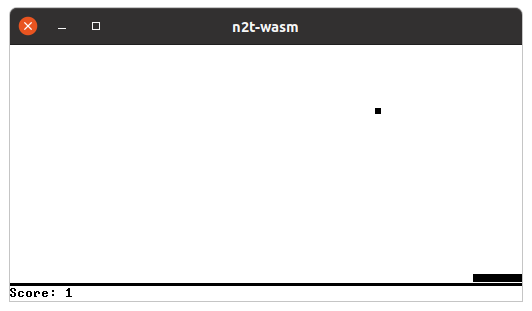
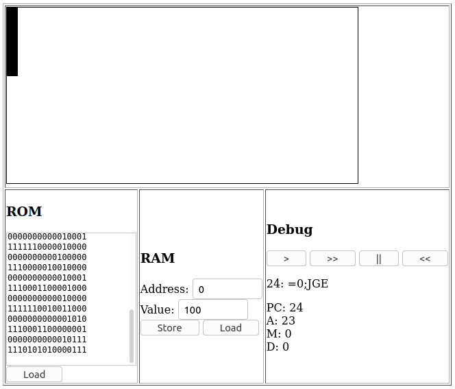

## n2t-wasm

Emulator for the [nand2tetris](https://www.nand2tetris.org/) computer (built
using Rust and WebAssembly).

<table>

<tr>
<td></td>
<th>Desktop</th>
<th>Browser</th>
</tr>

<tr>
<td>Overview</td>
<td>Spawns and draws on a window using the pixels crate.</td>
<td>Uses wasm to draw in the browser using HTML canvas.</td>
</tr>

<tr>

<td>Build</td>

<td>
<pre>
cargo run # In the src directory
</pre>
</td>

<td>

<pre>
wasm-pack build # In the src directory
npm run start   # In the www directory
</pre>

</td>
</tr>

<tr>
<td>Screenshot</td>
<td></td>
<td></td>
</tr>

</table>

_To run bigger programs (such as Pong.hack) you'll need to use the desktop
application instead of WebAssembly for now._

### Demo

https://abhaynayar.com/n2t-wasm/

- The `Rect.hack` _ROM_ is preloaded into the webpage.
- First click on `Load` to load the **ROM** into the emulator.
- Then **Store** the height of the rectangle at address 0 in the **RAM**.
- Finally hit the `>>` button.
- You'll see a rectangle get drawn on the screen!

### Backlog

- [ ] _Feature:_ Add keyboard support.
- [ ] _Bug:_ Fix the render loop in wasm.
- [ ] _Bug:_ Sanitize "Insert RAM" inputs.
- [ ] _Bug:_ Index of instruction should be within _ROM_ size.
- [ ] _Bug:_ Crash when `Rect.hack` is running with `RAM[0] > 513`.
- [ ] _Feature:_ Transfer words instead of pixels from wasm to js.
- [ ] _Feature:_ Show sample _ROMs_ and a file picker on the web page.
