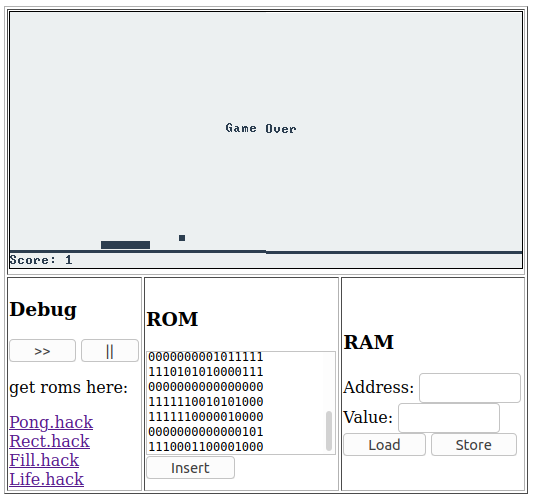

## n2t-wasm

Emulator for the [nand2tetris](https://www.nand2tetris.org/) computer.

### Screenshot



### Demo

https://abhaynayar.com/n2t-wasm/

### Build Instructions

Tested on Ubuntu 20.04 LTS.

Tools setup:
- Install rust: `curl --proto '=https' --tlsv1.2 -sSf https://sh.rustup.rs | sh`
- Install wasm-pack: `curl https://rustwasm.github.io/wasm-pack/installer/init.sh -sSf | sh`
- Install cargo-generate: `cargo install cargo-generate`
- Install node: `curl -o- https://raw.githubusercontent.com/nvm-sh/nvm/v0.35.3/install.sh | bash`

Clone this repository:

```
$ git clone https://github.com/abhaynayar/n2t-wasm
```

Building the emulator:
- Run `wasm-pack build` in the root directory. This will create a new pkg/ directory and build the wasm modules in it.
- Run `npm init wasm-app www` in the root directory. This will generate a web page in a new www/ directory.
- Run `npm install` in www directory to install the node modules.
- Run `npm run start` in the `www` directory to start a local testing instance.
- Run `npm run build` in the `www` directory to publish the results to `dist`.

### Backlog

- [ ] Create separate targets for wasm and pixels. Shouldn't have to comment code.
- [ ] _Feature:_ Add keyboard support.
- [ ] _Bug:_ Fix the render loop in wasm.
- [ ] _Bug:_ Sanitize "Insert RAM" inputs.
- [ ] _Bug:_ Index of instruction should be within _ROM_ size.
- [ ] _Bug:_ Crash when `Rect.hack` is running with `RAM[0] > 513`.
- [ ] _Feature:_ Transfer words instead of pixels from wasm to js.
- [ ] _Feature:_ Show sample _ROMs_ and a file picker on the web page.
